<h1 align="center">Abaco Zuzzurellone</h1>

<p align="center">
  <em>The whole Italian dictionary, strung between two absurd words —<br>
  a binary search you play instead of read about.</em>
</p>

<p align="center">
  <a href="https://abacozuzzurellone.site/"><b>▶ Play it</b></a>
  ·
  <a href="STATO.md">Stato / TODO</a>
  ·
  <a href="#the-three-modes">Modes</a>
  ·
  <a href="#the-technical-bit">How it works</a>
  ·
  <a href="#word-list-credits-and-licence">Word list</a>
</p>

<p align="center">
  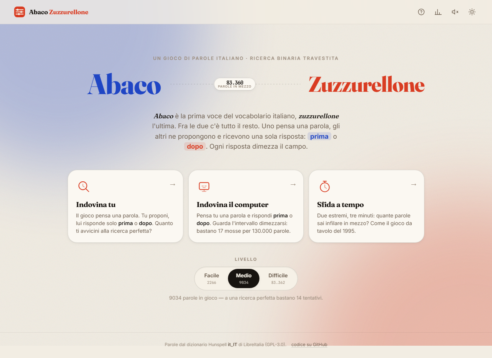
</p>

---

## What the game is

*Abaco* has traditionally been the first entry in an Italian dictionary and
*zuzzurellone* the last. They are the two ends of the search space, and the
old parlour game named after them works like this: **one player thinks of an
Italian word, the others propose words, and the only answer allowed is whether
the secret word comes *before* or *after* the proposed one in alphabetical
order.** Every answer narrows the interval. Whoever names the word wins.

It is, without ever saying so, a binary search over a dictionary — which is
what makes it a surprisingly good thing to turn into software: the algorithm
*is* the game, and you can draw it.

There is also a **board-game version** (Venice Connection / Unicopoli, 1995,
by Claudio Borgnino and Dario De Toffoli): given two words, you have three
minutes to write down as many words as you can that fall alphabetically
between them, with penalties for words outside the range or words that do not
exist. That version is mode three below.

---

## The three modes

### 1 · Indovina tu — *you guess*

The game picks a secret word; you propose words and get back only *prima* or
*dopo*. The interval bar contracts under you, the remaining-word counter
deflates, and when you finally land on it the game tells you how your attempt
count compares with a perfect binary search. Beating the optimum is possible —
binary search is worst-case optimal, and you can get lucky.

<p align="center">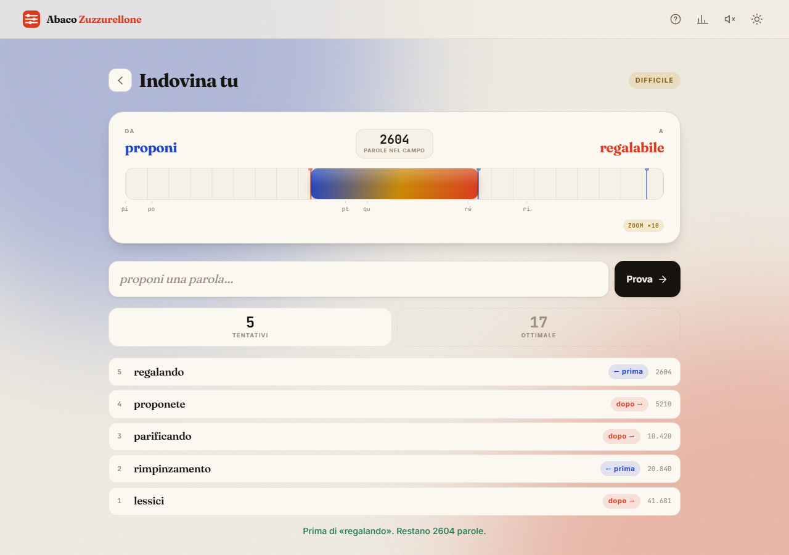</p>

Once the interval gets small the bar changes register: it **zooms into the
surviving slice of the alphabet**, and the scale below it switches from single
letters to two-, three- and four-letter prefixes. At the end you are reading
`inara · inarg · inari · inarm · inasi · inasp` on a field 1300× magnified.

<p align="center">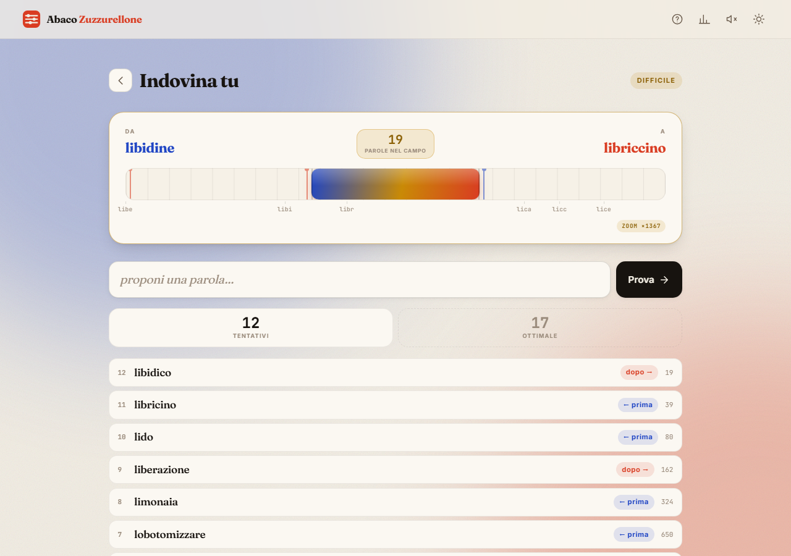</p>

### Open the alphabet

That zoomed scale is necessarily thinned out — labels that would collide are
dropped, and past a certain magnification it shows prefixes instead of letters.
So the bar opens. **Apri l'alfabeto** expands a panel that spells the same state
out in full: one cell per letter, the Italian ones plus the foreign `j k w x y`
(marked `str`), each with

* its **status against the current interval** — in play, half in (the letter
  that contains one of the bounds), or struck out because it falls before the
  left bound or after the right one;
* **how many of its words are still alive** and how many it has in total at the
  chosen difficulty — the `s` holds ten thousand, the `q` three hundred, and
  that gap is half the fun;
* a **proportional bar**: its length is the letter's weight in the vocabulary,
  the lit part is what is still in play.

The good bit is what happens when the field slips inside a single letter. The
panel **drops a level on its own** and starts showing the second characters —
inside `r`: `ra re ri ro ru`, with their own counts — then the third, then the
fourth. The breadcrumb above the grid (`tutto › r › ra`) says how deep you are.
It is the game itself made visible: first you pin down the first letter, then
the second, then the third.

<p align="center">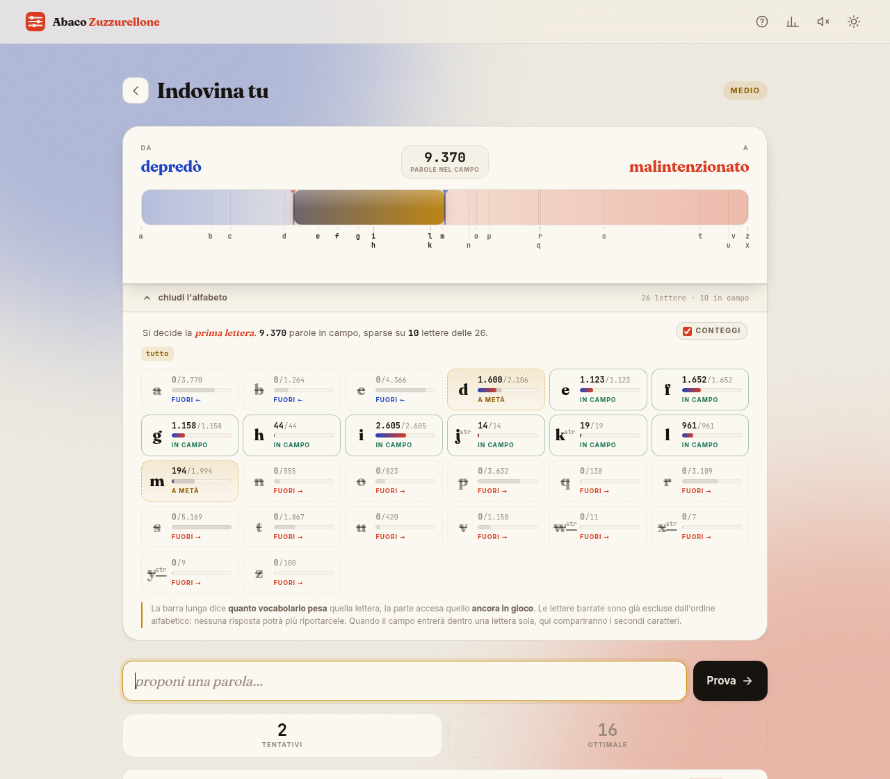</p>

The panel opens on a click or tap anywhere on the interval bar, from the button
under it, or from the keyboard — the button carries `aria-expanded`, and every
cell has a full sentence as its accessible name, so the state never rests on
colour alone. On a phone it comes up as a bottom sheet rather than a cramped
strip. It starts **open in the two teaching modes and closed in *Indovina tu***,
where holding the field in your head is the challenge, and it remembers what you
chose, mode by mode. A **conteggi** switch hides the exact numbers if you want
the shape without the arithmetic.

<p align="center">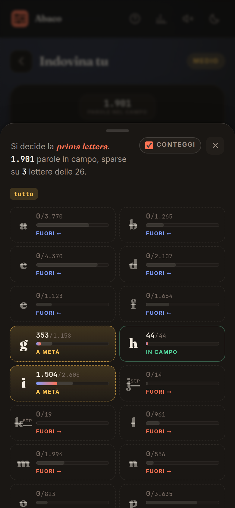</p>

### 2 · Indovina il computer — *the computer guesses*

You think of the word and answer *prima* / *dopo* / *è questa*. The computer
always plays the word that sits at the **median of the remaining candidates**
and shows you the count collapsing: 267 458 → 133 729 → 66 865 → … → 1. It is
the mode that makes the point: nineteen questions are enough for the entire
Italian vocabulary.

If your answers contradict each other the interval empties out, and the game
says so plainly instead of pretending.

<p align="center">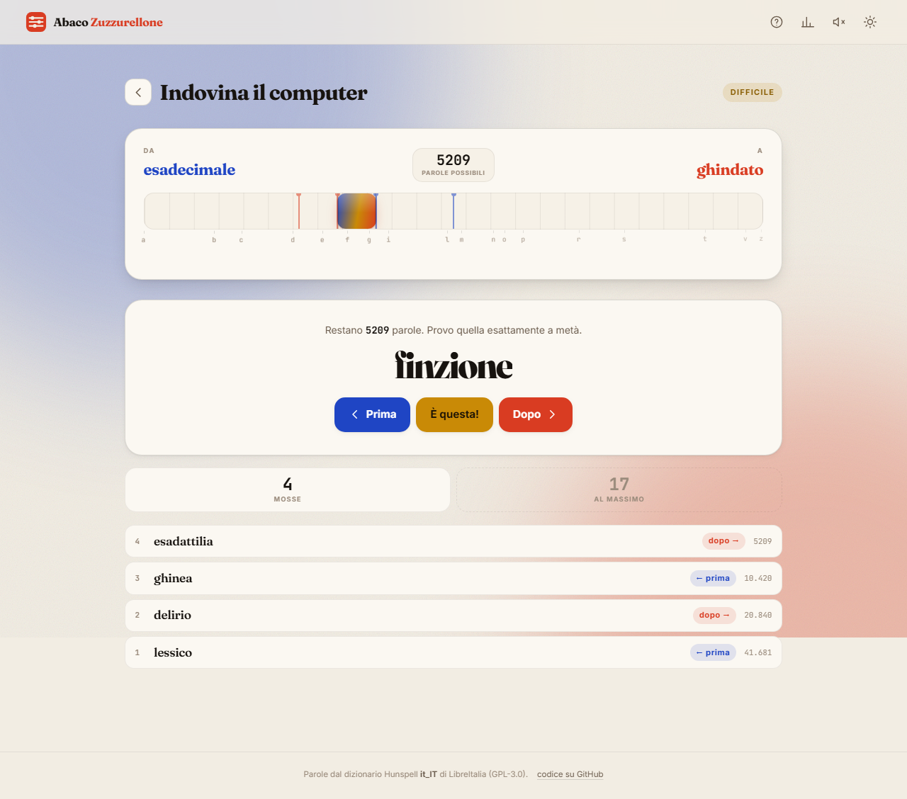</p>

### 3 · Sfida a tempo — *three-minute challenge*

Two random bounds, three minutes, as many in-between words as you can type.
**+1** for a valid word, **−1** for a word that exists but is out of range or a
word that is not in the dictionary at all, duplicates ignored. Each accepted
word drops a marker onto the interval bar, so you watch the range fill up.

<p align="center">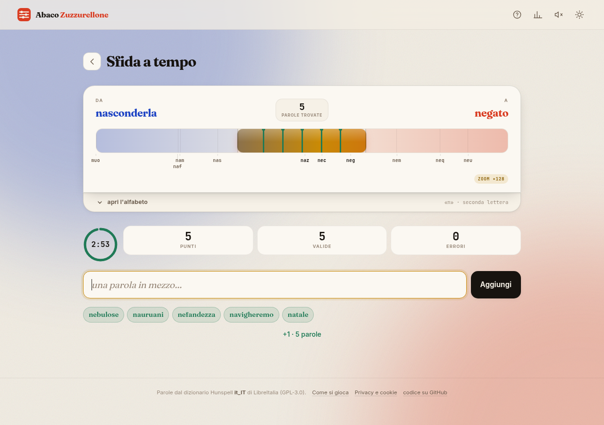</p>

### And at the end

A visual replay of the path: one bar per attempt, each as wide as the interval
that survived it. The staircase of halving, drawn.

<p align="center">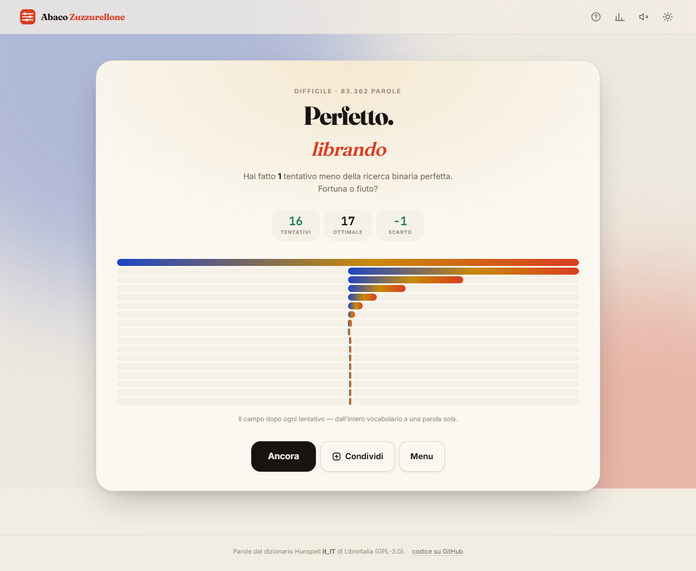</p>

---

## Also in the box

* **Three difficulty levels** — *facile* (5 469 common short words), *medio*
  (38 046), *difficile* (all 267 458, rare words and inflections included). The level chooses the
  universe the secret is drawn from and the one the counters talk about; your
  guesses are always checked against the full vocabulary, so you are never told
  a real Italian word does not exist.
* **Dark mode** following `prefers-color-scheme`, with a manual toggle that
  overrides it in both directions and is remembered.
* **Persistent stats** in `localStorage` — games, average attempts, best game,
  average gap from optimal, streak, and a histogram of how far off perfect you
  usually land. Every read and write is wrapped in `try`/`catch`, because some
  browsers throw on the mere mention of `localStorage`.
* **Wordle-style sharing** — a copyable text summary with the arrow trail of
  your guesses and a before/after bar of the search space.
* **Sound**, generated with the Web Audio API, no audio files, **off by
  default**.
* **`prefers-reduced-motion`** turns off every non-essential animation.
* Fully responsive, playable one-handed on a phone, keyboard-friendly
  (<kbd>Enter</kbd> submits, <kbd>Esc</kbd> goes back), `aria-live` on the
  feedback line, visible focus rings.

<p align="center">
  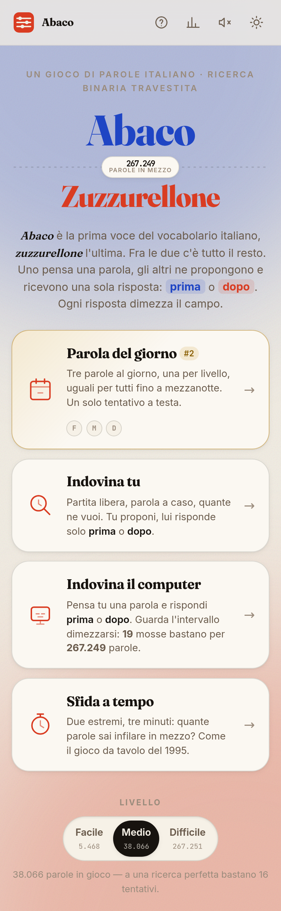
  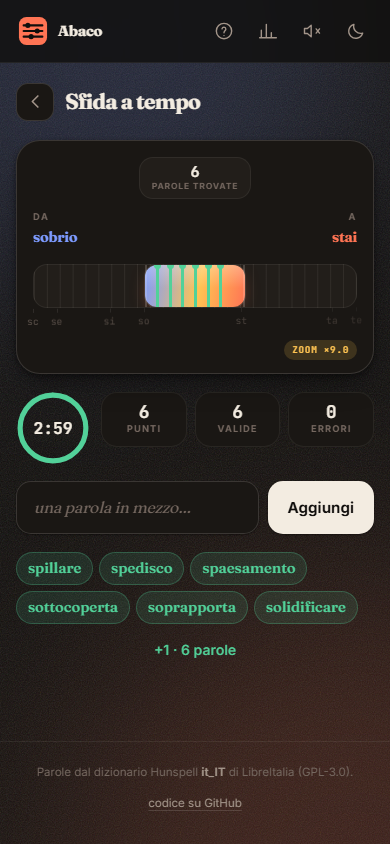
</p>
<p align="center">
  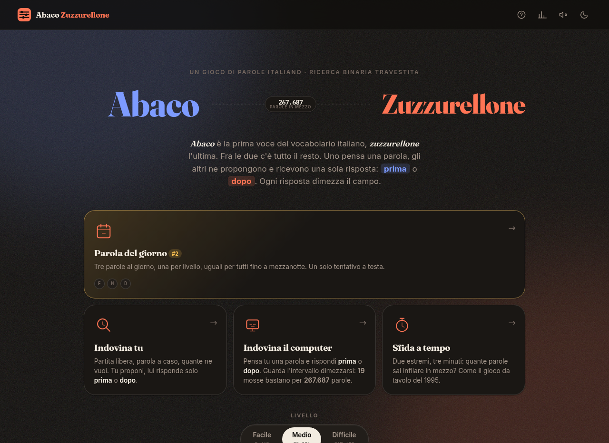
</p>

---

## The technical bit

### Italian collation, not code points

The naïve thing is `a < b` on strings. That sorts by UTF-16 code point, and
`ò` is `U+00F2`, which is greater than every ASCII letter — so `però` would
land after `perzona`, and an accented word would be unreachable by a binary
search that assumes otherwise. The game uses **`Intl.Collator('it')`**
everywhere a comparison happens, which treats the accent as a secondary
difference and gives the order a dictionary actually uses:

```
pera  <  pero  <  però  <  persona
```

The shipped word list is pre-sorted at build time with the same comparator, so
the browser never has to re-sort 267 458 words, and there is a test that walks
the whole file to prove the order holds.

### Why nineteen guesses are enough

Each *prima* / *dopo* answer is worth exactly one bit: it throws away half of
the surviving candidates. After *k* guesses at most `n / 2ᵏ` remain, so
`⌈log₂(n + 1)⌉` guesses always suffice — **19** for 267 458 words, **20** for a
million. Doubling the dictionary costs one extra question.

The subtlety the game makes visible: the word "in the middle" is *not* the word
in the middle of the alphabet. It is the word with half the vocabulary before
it and half after. That is why the alphabet scale under the bar is spaced by
**word count** rather than by letter — `s` alone takes more room than
`j k q w x y` put together, and the picture says it better than a sentence
does. Splitting on the median is what makes each answer worth a full bit.

### Interval rendering

One `requestAnimationFrame` loop drives two tweens at once: the interval itself
(an overshooting `easeOutBack`, so the bar snaps in with a bit of spring) and
the *viewport* — the slice of the alphabet currently framed. When the interval
drops below 5 % of the field the viewport starts closing in on it, keeping the
bar around a third of the track, and the scale labels are recomputed from the
words actually inside the frame. Labels that would collide are dropped by
weight, not left-to-right, so the letters that own the most vocabulary survive.

### Counting a letter without counting the words

The alphabet panel wants, on every guess, twenty-six pairs of numbers: how many
words each letter still has in play and how many it has in total. Walking the
267 458 entries to find out would be the obvious way and the wrong one.

Instead `AZ.breakdown(lo, hi, livello)` asks `lowerBound` for the twenty-six
boundaries `prefix+a`, `prefix+b`, … — twenty-six binary searches, seventeen
comparisons each — and then reads every count off the difficulty prefix-sums
already in `Dizionario`, which turns "how many words of this level sit in
`[a, b)`" into one subtraction. A full rebuild of the panel costs about
0.07 ms; a hundred of them do not register.

The descent falls out of the same call. The prefix it works at is simply the
**longest common prefix of the two current bounds**, accent-folded, so it is
`''` while the bounds start with different letters, `r` once both are inside
the `r`, then `ra`, then `rac`. The boundaries are then `raca`, `racb`, …, and
the "letters" of the panel are the third characters. Accented forms fold into
their base letter, so `élite` is counted under `e` and `però` under the `o` of
`per`, exactly where the Italian collator puts them; a word that *is* the whole
prefix (`re` inside `re…`) has no next character at all and gets a cell of its
own instead of being quietly lost.

### No build step, no dependencies, no CDN

Plain HTML, one stylesheet, two scripts. No framework, no bundler, nothing to
install. The word list is loaded through a `<script>` tag rather than `fetch()`
so the game **also works opened straight from disk over `file://`**, where
`fetch()` is blocked by the browser's CORS rules. Google Fonts are linked but
purely cosmetic — there is a real fallback stack, and the layout does not move
if they never arrive.

The list is front-coded before shipping: entries are sorted, so each one is
stored as `<shared-prefix length><suffix><difficulty tier>`, which takes
1.1 MB of plain text down to 465 KB with a nine-line decoder.

---

## Running it locally

Any static file server will do:

```bash
git clone https://github.com/Fedetrain/abaco-zuzzurellone.git
cd abaco-zuzzurellone
python -m http.server 8000      # or: npx serve .
# → http://localhost:8000
```

Or simply **double-click `index.html`** — it works from the file system too.

### Tests

Thirty tests cover Italian collation, the front-coding codec, `lowerBound`, the
per-difficulty interval counts, the alphabet breakdown and its descent through
prefixes, the median choice, `⌈log₂(n+1)⌉`, the full binary search
(exhaustively on a small dictionary, on 200 random words of the real one), the
detection of contradictory answers, and the timed-challenge scoring.

```bash
node tools/run-tests.mjs        # terminal
open tests.html                 # same tests, in the browser
```

### Rebuilding the word list

```bash
node tools/fetch-sources.mjs      # downloads the upstream lists
node tools/build-dictionary.mjs   # regenerates data/dizionario.{txt,js}
```

### Layout

```
index.html                 the whole UI
tests.html                 browser test runner
assets/core.js             pure logic: collation, codec, dictionary, search
assets/app.js              screens, the interval bar, modes, stats, sharing
assets/style.css           design tokens, layout, animation
data/dizionario.js         267 458 words, front-coded (this is what loads)
data/dizionario.txt        the same list, human-readable
data/SOURCE.md             provenance and licence of every data source
data/LICENSE-DIZIONARIO.txt  GPL-3.0, applying to data/ only
tools/                     fetch, build and test scripts
docs/                      screenshots
```

---

## Word list, credits and licence

> **The code is MIT. The word list is GPL-3.0.** They are kept apart on
> purpose: everything under `data/` is a derived work of a GPL dictionary and
> carries its own licence file. Nothing is silently relicensed.

| What | Source | Licence |
|---|---|---|
| **Vocabulary** (267 458 forms) | [LibreOffice Hunspell `it_IT`](https://github.com/LibreOffice/dictionaries/tree/master/it_IT) v5.1.1 — © Gianluca Turconi, Davide Prina, Andrea Pescetti, LibreItalia / Marina Latini | **GPL-3.0** |
| **Frequency list** (attestation + difficulty tiers) | [hermitdave/FrequencyWords](https://github.com/hermitdave/FrequencyWords), OpenSubtitles 2018 — © Hermit Dave | MIT |
| **Profanity filter** (subtracted, never shipped) | [napolux/paroleitaliane](https://github.com/napolux/paroleitaliane) — © Francesco Napoletano | MIT |
| **Word-form lists** (attestation only, never shipped) | [napolux/paroleitaliane](https://github.com/napolux/paroleitaliane) `280000` + `660000` — © Francesco Napoletano | MIT |
| **Game code, styles, tools** | this repository — © 2026 Federico Traina | MIT |

The Hunspell **affix rules are applied** (`tools/unmunch.mjs`), so the list is
not just the 95 000 lemmas but every inflected form they generate — kept only
where the form is actually attested: in the OpenSubtitles corpus, or — for
the written-language forms subtitles never use, *affermavamo*,
*visiteremmo* — in both napolux word-form lists, provided the lemma itself is
a common word. Without that step `casa`, `cani` and `mangio` were simply not
in the game, and players were told that ordinary Italian words do not exist.
Capitalised entries (proper nouns) and anything with apostrophes, hyphens or
digits are filtered out. The upstream files also carry one broken flag —
*sedere* and *possedere* had no conjugation at all, not even *siedo* or
*possiede* — which `tools/aff-patch.txt` repairs. A few dozen real words
missing upstream, from *zuzzurellone* to *bruschetta* and *app*, are added by
hand from `tools/extra-words.txt`, each checked against Treccani or Zingarelli.

Full details, filters and counts: [`data/SOURCE.md`](data/SOURCE.md).
Code licence: [`LICENSE`](LICENSE). Word-list licence:
[`data/LICENSE-DIZIONARIO.txt`](data/LICENSE-DIZIONARIO.txt).

Type is [Fraunces](https://fonts.google.com/specimen/Fraunces),
[Inter](https://fonts.google.com/specimen/Inter) and
[JetBrains Mono](https://fonts.google.com/specimen/JetBrains+Mono), all
SIL Open Font License, loaded from Google Fonts with a system fallback stack.
